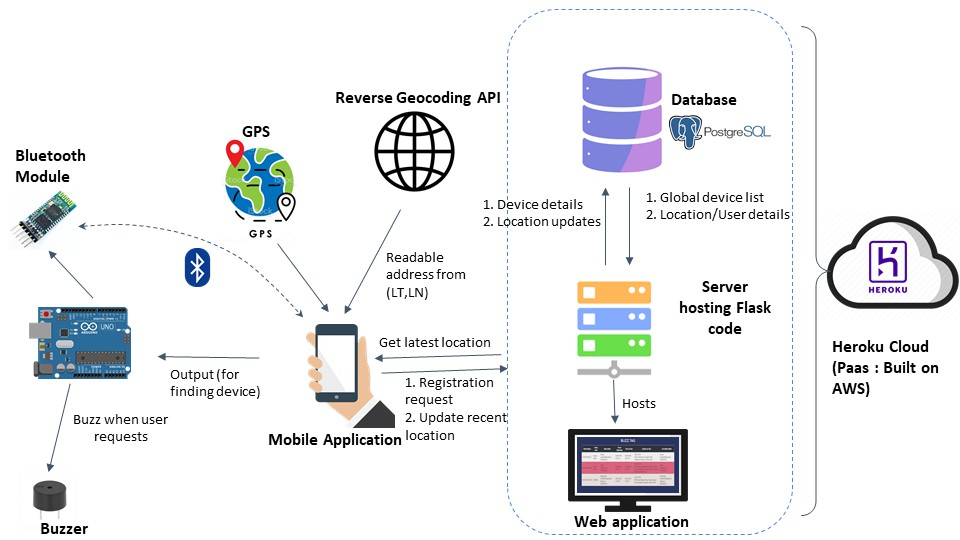

# BuzzTag - A Bluetooth enabled tagger to keep track of your things
## Introduction
Items like wallets, keys and backpacks often get lost with no easy way of finding them. This project aims to build a Bluetooth based tag to keep track of such items. The tag includes a buzzer to locate it, once it is in the range of the owner’s mobile device. The Android app on the user’s mobile helps in keeping track of the last recorded location of the tag. Location of a tag can get updated from any device that has the app when the tag is in range of the mobile device. It is not necessary for the tag to be registered for its location to update from the app. The contact details of the user who last updated the location of the tag can be viewed by the user who has registered the tag, thus enabling the user to find a lost item easily. A dynamic web page has also been provided for easier viewing the status of all registered devices.
## System Architecture

## Components
### The Tag
The tag consists of an Arduino UNO with a bluetooth module, connected to a buzzer through resistors. The tag is to be attached or kept in items likely to get lost. The Bluetooth makes the tag visible to the user’s mobile app identified by the Bluetooth module’s name and MAC address. If the tag receives a message of ‘1’ over Bluetooth, the microcontroller makes the buzzer sound a specific tune. This helps in locating the tag. 
### Android app
* [Github Link](https://github.com/samina-mulani/IoT-Project-Android-app)  
* The Android app on the user side offers several functionalities. One can register a tag, buzz the tag, view its latest location and update the location of nearby tags within the mobile’s Bluetooth range. For updating or recording the location of a tag, the phone’s GPS is used. When the location of a tag is viewed by the user, a reverse geocoding API gets a human understandable location from the latitude and longitude. More on the functionalities offered by the app is described in a later section.
### Flask Web Server and PostgreSQL database
Both these components are present in the cloud (Heroku PaaS used for hosting). The database holds information about the registered tags, their owners and the location updates for these tags. The Flask web server provides endpoints for communication between the Android app and relevant information from the database. The server also hosts a dynamic website for viewing information about the registered devices and their recent location. ([Website Link](https://iot-project-314.herokuapp.com/))
#### Database details
PostgreSQL database is used with 2 tables.The first stores the tag details like MAC address, device name, owner details and registration date.The second table stores the location updates and updater details of all the tags.
##### Table 1
Name: registration_info  
Description: Populated when a user registers a device using their Android phone.  
Schema:  
| Field name    | Type    | Description                               |
|---------------|---------|-------------------------------------------|
| deviceAddress | String  | MAC address of the device                 |
| deviceName    | String  | Name of the device                        |
| ownerName     | String  | Name of person registering device         |
| ownerNumber   | String  | Phone number of person registering device |
| ownerEmail    | String  | Email of person registering device        |
| timestamp     | Integer | UNIX timestamp                            |
##### Table 2
Name: location_updates  
Description: Populated every time a user updates location of a device (either from global list of all devices or list of locally registered devices). Queried to obtain the most recent location of any device/tag.  
Schema:  
| Field Name    | Type    | Description                                        |
|---------------|---------|----------------------------------------------------|
| deviceAddress | String  | MAC address of the device                          |
| deviceName    | String  | Name of the device                                 |
| updaterName   | String  | Name of person updating location of device         |
| updaterNumber | String  | Phone number of person updating location of device |
| updaterEmail  | String  | Email of person updating location of device        |
| timestamp     | Integer | UNIX timestamp                                     |
| latitude      | String  | Latitude of updated location                       |
| longitude     | String  | Longitude of updated location                      |
#### Flask Web application endpoints
The Flask application (hosted on Heroku) provides a set of endpoints for communication between the database and Android app. It also hosts a dynamic web application which displays the list and details of all registered devices or tags.  
| Path/Route             | Method | Function               | Description                                                                                                                                                                                                        | Response                                                                                                                                                                                                                                       |
|------------------------|--------|------------------------|--------------------------------------------------------------------------------------------------------------------------------------------------------------------------------------------------------------------|------------------------------------------------------------------------------------------------------------------------------------------------------------------------------------------------------------------------------------------------|
| /                      | GET    | mainPage()             | The main data visualisation page depicting all registered devices or tags with basic details (like device address, name, owner details, registration time) and most recent                                         | Returns rendered ‘index.html’ template                                                                                                                                                                                                         |
| /registerDevice        | POST   | registerDevice()       | Endpoint used by Android app to register a device/tag. Inserts a new record in the registration_info table and location_updates table.                                                                             | Returns a success code of 200 if data successfully written to both tables Returns an error code of 400 if any information required to populate the tables is absent                                                                            |
| /sendLocationUpdate    | POST   | sendLocationUpdate()   | Endpoint used by Android app to update location of a device/tag. Inserts a new record in the location_updates table.                                                                                               | Returns a success code of 200 if data successfully written to the table Returns an error code of 400 if any information required to populate the table is absent                                                                               |
| /getLocation           | GET    | getLocation()          | Endpoint used by Android app to get the most recent recorded location of a device. It takes in the device address as a request parameter and queries the location_updates table to get the last recorded location. | Returns a success code of 200 with a JSON response body of the last location if query was successful Returns an error code of 400 if deviceAddress not present as request parameter Returns an error code of 500 if device/tag not in database |
| /getListRegistered     | GET    | getList()              | Endpoint used by Android app to get the whole list of registered devices/tags.                                                                                                                                     | Returns success code of 200 along with a JSON response with list of addresses of registered devices/tags                                                                                                                                       |
| /delete                | GET    | deleteAll()            | Deletes a device and its details from the database. Used for debugging. Takes in device address as request parameter                                                                                               | Returns a success code of 200 if deletion successful                                                                                                                                                                                           |
| /viewRegisteredDevices | GET    | getRegisteredDevices() | Used to display a list of registered devices and basic details. Used for debugging.                                                                                                                                | Returns a success code of 200 with list of registered devices in JSON format                                                                                                                                                                   |
| /viewLocationUpdates   | GET    | getLocationUpdates()   | Used to view a list of all location updates provided. Used for debugging.                                                                                                                                          | Returns a success code of 200 with list of location updates in JSON format                                                                                                                                                                     |
#### Other APIs used (by Android app and Flask backend)
Nominatim API - Reverse geocoding API to get a readable address from latitude and longitude. ([Reference](https://nominatim.org/release-docs/develop/api/Reverse/))
## Flow and Working from User side
* The app opens with a page to register the user details. It asks for bluetooth and location permissions. This app provides 4 major features:
  * Register New Device
  * Buzz your Device
  * Get Recent Location
  * Scan and Update
* First, the user has to register his device. For this, he uses the Register New Device   button.This button displays the list of all Bluetooth devices available in the user’s range. The device he picks up is stored in the database with him being designated as the owner.
* The User can then check the most recent location of any of his devices by using the Get Recent Location feature. Immediately after registration, it will show the location during the time of registration, as recorded by the phone’s GPS. This location can be updated by not only the owner but also by the other users of the app. This feature is useful in tracking down the lost devices of a user. Along with the location, the user will get the updater’s name and contact details. Hence, they can contact the updater in case they want them to pick their device.
* After reaching the latest location of his lost device, the user can use the feature Buzz your Device. The device will start buzzing when the user is in its bluetooth range. Hence, the user will be able to find it.
* There is another feature, Scan and Update. In case, the user's device is lost and he is out of its bluetooth range. Then, if any other registered user comes in the bluetooth range of his lost device, then his device’s location will be updated using GPS of that user’s mobile when he clicks on this scan and update button. So, if anyone sees any lost device, he can press this button and it will update the device’s location in the global list for its owner. When the owner presses the get recent location button, he will get this most updated location.  
## Future Scope
* Background bluetooth scanning and location updates at regular intervals.
* Using BLE (Bluetooth Low Energy) instead of bluetooth.
* Making the device more compact and rigid (by using Arduino Beetle, and so on).
* App optimization to make it less power consuming.

